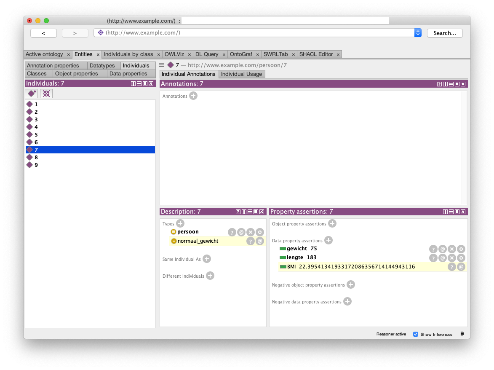

# Ontologie voor verschillende databronnen
Eén van de praktische mogelijkheden van een ontologie is de kennis die in de ontologie beschreven is, gebruiken om data uit verschillende bronnen te 'begrijpen'.

Wanneer je vervolgens de data benadert via de ontologie, maakt het eigenlijk niet meer uit dat dezelfde gegevens uit verschillende bronnen, op verschillende manieren is geschreven. Een query op de data geeft hetzelfde resultaat, onafhankelijk van het formaat van de data.

In dit document worden de mogelijkheden om een ontologie te gebruiken verkend aan de hand van een praktisch voorbeeld. Het voorbeeld gaat over de body mass index (BMI) van patiënten. De BMI is een waarde die afgeleid wordt uit het gewicht en de lengte van een persoon.
```
BMI = gewicht / lengte<sup>2</sup>
```
Op basis van deze berekening kan het gewicht worden gecategoriseerd volgens onderstaande tabel:

BMI waarde | Categorie
:--------------:|:---------------
\< 18,5 | ondergewicht
18,5 - 25 | normaal gewicht
25 - 30 | overgewicht
\> 30 | obese

Stel dat we drie datasets hebben, gebaseerd op een verschillende manier om het BMI van een persoon te registreren.
1. BMI geregistreerd als getal
2. BMI geregistreerd als categorie
3. Aparte registratie van lengte en gewicht

Hierdoor ontstaan tabellen van onderstaande formaten
### dataset 1
Persoon | BMI
:----:|:----:
1|27
2|18
3|23

### dataset 2
Persoon | BMI Categorie | *(dus BMI is)*
:-----:|:-----|:-----:
4|ondergewicht|*\< 18,5*
5|normaal gewicht|*18,5 - 25*
6|overgewicht|*25 - 30*

de derde kolom is geen onderdeel van de data(!)
### dataset 3
Persoon | lengte (cm) | gewicht (kg)| *(dus BMI is)*
:-----:|:-----:|:-----:|:-----:
7|183|75|*22,4*
8|167|68|*24,4*
9|192|112|*30,4*

de vierde kolom is geen onderdeel van de data(!)
# De ontologie
Op basis van de gegeven tabellen kunnen we een eenvoudige ontologie maken. We maken gebruik van [Protégé](https://protege.stanford.edu/).
## Klassen
We hebben eeen klasse nodig waarin de personen een instantie zijn. We noemen de klasse 'persoon'. De verschillende categorieën, afhankelijk van de BMI, maken we subklassen van persoon.

De subklasse 'obese' bevat dus alle personen die een BMI hebben van meer dan 30. De naam van de klasse zou dan ook 'obese personen' kunnen zijn, hetgeen iets minder cryptisch is dan alleen de naam 'obese'. Omdat we hier maar een hele kleine ontology maken, gebruiken we voor de simpele variant.


De instanties in de klasse 'persoon' kunnen drie eigenschappen hebben. Drie data-properties:
* lengte (integer)
* gewicht (integer)
* BMI (decimal)


## Individuen (instances)
Nu we de klassen hebben, kunnen we de 9 personen uit de verschillende datasets aanmaken. In de praktijk zal de data eigenlijk nooit in Protégé ingevoerd worden, maar separaat zijn opgeslagen in een of andere vorm. Omdat in dit kleine voorbeeld de omvang zo beperkt is, is het gewoon handig dit binnen Protégé te houden.

Niet alleen voorkomt het dat we zoiets als een triple store nodig hebben, het geeft ook direct de mogelijkheid om het model inclusief de data te controleren op logische consistentie en om te kijken of Protégé op basis van het kennismodel ontbrekende informatie zelf kan aanvullen. Precies het doel van deze hele oefening.

Personen 1 t/m 3 en 7 t/m 9 zijn 'gewoon' lid van de klasse 'persoon' en kunnen we als zodanig aanmaken. In dit voorbeeld geven we ze een Unique Resource Identifier (URI) in de volgende vorm:
```
http://wwww.example.com/persoon/id
```
Als id gebruiken we simpelweg de nummers uit datasets.


Voor personen 4 t/m 6 geldt dat we hier de kennis over hun BMI toevoegen door ze lid te maken van de juiste subklasse. In dit geval hebben we geen exacte kennis over het BMI, maar wel over de range. Hierna zullen we de kennis over de range toe gaan voegen aan de subklassen, zodat Protégé hier ook daadwerkelijk conclusies over BMI op kan baseren.
Voor nu volstaan we door drie individuen aan te maken volgens de bovenstaande URI en ze lid te maken van de juiste subklasse.

## Eigenschappen
De kennis uit de datasets voor personen 4 t/m 6 is nu toegevoegd door de subklassen te gebruiken. Voor de overigen kennen we de waarden toe aan de data poperties die we aangemaakt hebben. Voor 1 t/m 3 vullen we de eigenschap BMI, voor 7 t/m 9 vullen we zowel de eigenschap lengte als gewicht.


Hiermee is alle kennis die we hebben over de 9 personen toegevoegd. We moet nu de algemene kennis toevoegen die de verschillende vormen van de data met elkaar in verband kan brengen.

## Kennismodel
De ontologie is bedoeld als kennismodel waarbij in dit geval de kennis over BMI wordt vastgelegd. Dit komt neer op kennis over hoe BMI berekend wordt uit de lengte en het gewicht van een persoon en de manier waarop die waaarde leidt tot een zekere classificatie van personen. We beginnen bij de laatste, mede omdat het berekenen van waarden niet zomaar te doen is binnen OWL. Later meer over daarover.

De classificatie voegen we toe door bij iedere subklasse de grenzen aan te geven van de BMI waarden waarbinnen iemand tot die subklasse behoort. We gebruiken hiervoor de BMI classificatie tabel.

We starten de classificatie 'ondergewicht', waarvoor geldt dat de BMI kleiner is dan 18,5. Door op het plusje te klikken naast 'SubClass Of', kun je eigenschappen toevoegen. Hier willen we aangeven dat iedereen die lid is van de klasse 'ondergewicht' een waarde heeft voor de data property 'BMI' lager is dan 18,5. We doen dit door in de 'Class expression editor' aan te geven
```
BMI some xsd:decimal[< 18.5]
```


Als daarna op OK klikt, ziet de klasse er als volgt uit.


Uit hetgeen onder de noemer 'SubClass Of' staat kun je de volgende twee feiten concluderen.
* ieder lid van de klasse 'ondergewicht' is ook lid van de klasse 'persoon'
* ieder lid van de klasse 'ondergewicht' heeft een waarde kleiner dan 18,5 voor de eigenschap 'BMI'.

Dit wil echter nog niet zeggen dat iemand die een persoon heeft en een BMI heeft onder de 18,5 dús ook automatisch lid is van de klasse 'ondergewicht'. De voorwaarden zoals die nu gedefinieerd zijn noemen we dan 'necessary' (ofwel, als je in de klasse ziet, moet je die eigenschappen hebben), niet 'sufficient' (ofwel, niet voldoende om lidmaatschap te garanderen).

Dit is best een lastig concept, dus toch nog maar een voorbeeld. Als je lid bent van de klasse 'voetballer' en de subklasse 'in het eerste van Ajax', mag je best concluderen dat die persooen een goede voetballer is. Maar het is niet zo dat als je een goede voetballer bent, dat voldoende is om ook automatisch in het eerste van Ajax te spelen. 'Goede voetballer' is noodzakelijk, maaar niet voldoende (necessary, maar niet sufficient).

Wat we echter bedoelen in ons kennismodel is wel degelijk dat iemand met een BMI lager dan 18,5 per definitie tot 'ondergewicht' behoort. Let op de taal: dat is namelijk precies de hele definitie van die klasse. Er zijn geen andere condities waaraan voldaan hoeft te worden.

Je bereikt dit door van de klasse 'ondergewicht' een 'defined class' te maken. Je vindt deze optie (convert to defined class) in het menu 'Edit'. Na het kiezen van deze optie zit de klasse er als volgt uit.


De klasse 'ondergewicht' is equivalent aan de klassen van individuen die zowel 'persoon' zijn als een BMI hebben van minder dan 18,5.

Hetzelfde doen we voor de andere drie subklassen, waarbij we erop letten dat de grenswaarden van de BMI klassen niet dubbel voorkomen. Een BMI van precies 25 kan maar in 1 subklasse voorkomen, anders krijgen we conflicten.

Om aan te geven dat de vier subklassen de volledige classificatie is van personen (dus iedereen is lid van precies één klasse) geven we bij de klasse persoon aan dat deze de 'Disjoint Union' is van de vier subklassen.


# Reasoning
Op basis van de kennis die we inmiddels hebben toegevoegd zou voor de personen waarvoor een BMI bekend is moeten kunnen afleiden in welke subklasse van 'persoon' zij lid moeten zijn. We kunnen dit in Protégé doen door een zogenaamde 'reasoner' te gebruiken. Het is mogelijk om verschillende reasoners als plugin toe te voegen aan Protege. Hier gaan we ervan uit dat je de Pellet reasoner hebt geinstalleerd en dat deze gekozen is in de het menu 'Reasoner'. Andere reasoners geven in dit geval hetzelfde resultaat. Als we meer complexe zaken willen laten beredeneren zijn soms gespecialiseerde reasoners nodig. Pellet voldoet meestal prima.
In hetzelfde menu kunnen we de reasoner starten ('Start Reasoner'). Nadat we dit gedaan hebben kunnen we voorbeeld zien dat persoon 2 geclassificeerd is als 'ondergewicht'. Wat klopt met het BMI van 18.


In de figuur hierboven zie je dat de klasse 'ondergewicht' twee instanties kent (of 'leden heeft'), nl. persoon 2 en 4. Van persoon 4 hadden we dit zelf handmatig aangegeven bij het creëren van die persoon. Van persoon 2 komt de reasoner tot de conclusie dat deze persoon lid moet zijn van die klasse. 

Protege geeft dit weer door deze kennis in een gele balk te laten zien. Let ook op het vinkje rechtsonder bij 'Show Inference', wat zoveel zegt als: laat conclusies zien. Die conclusies staan in een geel balkje. Je kunt in de figuur zien dat er meer conclusies worden getrokken.
* 'ondergewicht' is een subklasse van 'persoon'. Deze ligt wel erg voor de hand natuurlijk.
* 'ondergewicht' is Disjoint With de andere drie subklassen. Iets dat we hebben uitgelegd door de zeggen dan 'persoon' de Disjoint Union is van de bewuste vier klassen.

Voor de andere klassen voegen we hetzelfde soort kennis toe en maken we de klassen 'defined classes'. Hieronder de exacte formulering die gebruikt is. Deze syntax komt precies en is niet altijd eenvoudig te vinden online.
```
ondergewicht:    BMI some xsd:decimal[< 18.5]
normaal_gewicht: BMI some (xsd:decimal[>= 18.5] and xsd:decimal[< 25])
overgewicht:     BMI some (xsd:decimal[>= 25] and xsd:decimal[< 30])
obese:           BMI some xsd:decimal[>= 30]
```

Wat resteert is het berekenen van de BMI voor het geval de data bestaat uit lengte en gewicht. We gaan dat doen met belulp van de Semantic Web Rule Language [(SWRL)](https://www.w3.org/Submission/SWRL/).

## SWRL
Voordat we de functionaliteit van SWRL kunnen gebruiken in Protege, moeten we de SWRL editor toevoegen als Tab. Dat kan via het menu Window - Tabs, waar SWRLTab aangevinkt kan worden. Als je deze keuze niet ziet, dien je deze als plugin toe te voegen.

Aangezien dit document niet bedoeld is als tutorial van SWRL zal het niet te dien ingaan op deze taal. Voor hier is het genoeg te weten dat het een toevoeging is op OWL die het o.a. mogelijk maakt om te rekenen met data properties. De taal is op allerlei manieren uit te breiden om bijvoorbeeld te kunnen werken met geografische data. Je kunt dan vragen stellen als "geef alle instanties van het type bushalte binnen een straal van 2km rondom een instantie van het type ziekenhuis". Wij zullen de ingebouwde mogelijkheden gebruik om eenvoudig te rekenen.

Omdat de rekenstappen erg basaal zijn, is de syntax die we nodig hebben best lang. Het kan daardoor ook ingewikkeld lijken. Maar als je snapt wat er staat, valt het alleszins mee. De 'rule' die wij gaan gebruiken ziet er als volgt uit.

Je ziet een aantal statements gescheiden door een dakje ^ en het laatste statement wordt voorafgegaan door ->

De betekenis is dat er eerst voorwaarden zijn die allemaal moeten gelden en wanneer dat het geval is, dan geldt het statement na de ->. Kortom de ^ kun je zien als 'AND' en the -> als 'THEN'. Wat staat er nu precies, stap voor stap, van links naar rechts.
```
ALS er een persoon is, geef die de variabele p (?p betekent variabele p)
EN die persoon heeft lengte l
EN die persoon heeft gewicht g
EN l1 is gelijk aan l gedeeld door 100
EN l2 is gelijk aan l keer l
EN bmi is gelijk aan g gedeeld door l
DAN is de BMI van persoon p gelijk aan bmi
```
Een aantal dingen valt op
* de formule om bmi uit te rekenen uit lengte en gewicht, vergt meerdere stappen. Dat komt doordat je alleen gebruik kunt maken van de basale berekeningn waarbij je per berekening maar twee variabelen gebruikt.
* de lengte wordt gedeeld door 100. Dat is noodzakelijk omdat we de lengte in cm registreren, terwijl de formule voor BMI uitgaat van meters. In een meer geavanceerde vorm van de ontologie zou je best eenheden mee kunnen modelleren, waarbij je daar rekening mee houdt in het omrekenen.
* we gebruiken een prefix voor de berekeningen swrlb:. Deze staat voor SWRL Builtin functie.
* Nu nog net zichtbaar, maar Protege zal zelf ook prefixes toekennen aan zaken als 'persoon' en 'lengte'. Dit is nodig om de gebruikte termen uniek te kunnen identieficeren.

Wanneer je nu de reasoner opnieuw synchroniseert, zal Protege de berekening uitvoeren voor alle personen waarbij zowel lengte als gewicht bekend zijn en vervolgens de berekende waardoe toekennen aan de data property 'BMI'.



Hierboven zie je het resultaat voor persoon 7. Zoals gebruikelijk wordt de afgeleide informatie weergegeven in een gele balk. Hier zie je dus dat de BMI berkend is met als resultaat een waarde van ca. 22,4. Je ziet ook dat deze persoon (daardoor) geclassificeerd is als een instantie in de klasse 'normaal_gewicht'.

Als je in het bovenstaande scherm in Protege nu de verschillende personen een voor een aanklikt, kun je zien dat alle personen zijn geclassificeerd in een van de vier gewichtsklassen die we aangemaakt hebben. Voor personen 1 t/m 3 classificeert de reasoner op basis van de gegeven BMI. Personen 4 t/m 6 zijn al geclassificeerd en voor personen 7 t/m 8 geldt dat eerst de BMI berekend wordt o.b.v. lengte en gewicht, waarna deze op dezelfde manier worden geclassificeerd al 1 t/m 3.

Hiermee is aangetoont dat door Protege uit te leggen wat de betkenis is van zaken als gewicht, lengte en BMI, personen geclassificeerd kunnen worden op basis van verschillende informatiebronnen.

Klik nog maar eens alle personen aan, net zoals hierboven, waarbij je het vinkje bij 'Show Inference' (rechts onder) nu uit zet. Dan kun je weer zien hoe weinig gegevens in de 'echte' data vastligt en welke gegevens toegevoegd kunnen worden op basis van dit kleine model.

# Query
We hebben nu drie verschillende databronnen 'samengebracht' door uit te leggen wat de betekenis van de verschillende elementen en hun onderlinge samenhang is. We hebben de data op een bepaalde manier samengevoegd, maar zonder de oorspronkelijke data te converteren. Daar is niets aan gewijzigd.

Natuurlijk is het zo dat je door kennis toe te voegen geen details aan de bestaande data kunt toevoegen. Als de informatie start op een 'lagere resolutie' zoals voor personen 5 t/m 7. Kun je de resulotie niet verhogen. Je weet van deze groep wel wat de range is waarin de BMI zich bevindt, maar de exacte BMI is hieruit nooit af te leiden. Hetzelfde geldt voor de groep waarvan alleen de BMI bekend is; daaruit zal nooit lengte en/of gewicht af te leiden zijn.

Set | Classificatie | BMI | Lengte/Gewicht | Resolutie
:----:|:----:|:----:|:----:|:----:
1|mogelijk|bekend|onmogelijk|midden
2|bekend|onmogelijk|onmogelijk|laag
3|mogelijk|mogelijk|bekend|hoog

In bovenstaande tabel is dit geïllustreerd. De kolommen zijn met oplopende 'resolutie' gesorteerd. Je kunt zien dat je vanaf een bepaalde bekende resolutie wel lagere resoluties af kunt leiden, maar andersom is niet mogelijk. Hieruit zou je mogen concluderen dat in deze case het vastleggen van lengte en gewicht de voorkeur heeft.

De vraag is wat het gevolg hiervan is als je een query op de data uit wilt voeren. Laten we hiervoor de tabel met waarden en classificatie nog een keer herhalen.

BMI waarde | Categorie
:--------------:|:---------------
\< 18,5 | ondergewicht
18,5 - 25 | normaal gewicht
25 - 30 | overgewicht
\> 30 | obese

Als je in een query zou willen weten wie er allemaal een BMI heeft van minder dan 24,5 is deze vraag volledig te beantwoorden van de personen waarvoor de BMI bekend is, of afgeleid kan worden (set 1 en 3). Voor set 2 geldt dat in de resolutie van die set een antwoord gegeven kan wordt op de query. In dit voorbeeld betekent dit dat voor alle personen in de klasse 'ondergewicht' met zekerheid vastgesteld kan worden dat deze een BMI hebben van minder dan 24,5. Van personen in de klasse 'normaal gewicht' is het niet met zekerheid vast te stellen en van personen in de twee andere klassen is met zekerheid vast te stellen dat ze niet een BMI hebben van minder dan 23.

Gegeven deze query krijg je dus alle personen uit set 1 en 3 met een BMI van minder dan 24,5 en alle personen uit de klassen 'ondergewicht' van set 2. De klasse 'normaal_gewicht' zou personen kúnnen bevatten die hieraan voldoen, maar omdat dat niet vastgesteld kan worden zal het resultaat van de query geen personen uit die klasse weergeven.

Dat is natuurlijk jammer, maar de query geeft wel het maximaal haalbare resultaat, gegeven de resolutie van de data. In Protege is het mogelijk om een dergelijke query uit te voeren. Daarvoor kun je de tab 'DL query' (van Descriptive Logics Query) activeren via het menu 'Window - Tab'.


Als resultaat zie je alle personen waarvan met zekerheid vastgesteld kan worden dat ze aan de voorwaarde voldoen. Je ziet ook dat Protege 'snapt' dat de klasse 'ondergewicht' voldoet aan deze voorwaarde. Met andere woorden: alle instanties in de klasse 'ondergewicht' voldoen aan de gestelde voorwaarde in de query.

Dus alhoewel personen uit set 2 geen informatie bevatten met de resolutie op het nivo van BMI, is het wel degelijk mogelijk om een query uit te voeren op die resolutie, waar bij ook de data uit set 'mee doet' in het antwoord op de query. En dat zonder dat we de data van set hebben geconverteerd! Maar door de betekenis van de classificatie in set 2, uit te leggen in termen van een range in een hogere resolutie.

Waarom is dit nu zo interessant? In de praktijk zie je vaak dat data die over langere tijd wordt verzameld niet altijd met dezelfde definities en/of resoluties is vastgelegd. Door uit te leggen hoe de verschillen zich tot elkaar verhouden, is het mogelijk verschillende 'versies' van data in één keer te bevragen en een zinnig antwoord te krijgen, zodat dat (historische) data geconverteerd hoeft te worden.
# Overwegingen
Hierboven is in een zo eenvoudig mogelijk voorbeeld uitgewerkt hoe een ontolgie en reasoing gebruik kan worden om verschillende dataset aan elkaar te kunnen koppelen zonder conversie. Hieronder volgen nog enkele overwegingen waarvan enkele nog verder uitgewerkt zullen/kunnen worden in andere voorbeelden.

## Complexiteit
BMI in dit voorbeeld is een eenvoudige variant. In de realiteit bestaan verschillen tussen de classificatie voor mannen en vrouwen. Hetzelfde geldt voor de classificatie van (jonge) kinderen.

Het model zou voor een vollediger omschrijving van de kennis omtrent BMI dan ook uitgebreid kunnen worden met begrippen als geslacht en leeftijd. Waarbij leeftijd natuurlijk weer opgebouwd kan worden uit geboortedaum en 'heden'.

Eén van de uitdagingen bij het ontwikkelen van ontologieën is weten wanneer je moet stoppen met het modelleren van meer detail. Je zou ook het begrip geboortedatum weer verder kunnen modelen zodat meerdere kalenders (Gregoriaan, Chinees, etc.) allemaal 'begrepen' kunnen worden. Er bestaan geen echte regels hiervoor. Het antwoord op de vraag wanneer je zou moeten stoppen kan alleen gegeven worden vanuit het beoogde gebruik.

## Tijd
Alhowel hierboven zoiets als leeftijd al is aangestipt, houdt het model uit dit voorbeeld geen rekening met het verstrijken van de tijd. Immers: de lengte en het gewicht (en daarmee de BMI) van een persoon is alleen maar de lengte en het gewicht op een bepaald moment in de tijd; het moment waaraop beide gemeten zijn. Dus nog los van de leeftijd overweging.

In OWL is het niet rechtstreeks mogelijk om uit te drukken dat een bepaalde eigenschap alleen geldig is op een bepaald moment of in een bepaalde periode. De relatie tussen persoon en gewicht kan niet worden voorzien van een timestamp (zoals dat wel kan wanner je in plaats van triples werkt met een annotated property graph).

Binnen OWL zijn er echter wel zogenaamde designpatterns gebruikelijk om dit probleem op te lossen. Of het daadwerkelijk een probleem is die de extra complexiteit van zo'n patroon het waard is om het probleem op te lossen, hangt volledig van de specifieke toepassing af.

In het voorbeeld van gewicht van een persoon is het gebruik om een klasse aan te maken waarin de meting van het gewicht een instantie is. Die meting heeft dan een object property die de meting aan een persoon koppelt en een data property met de waarde van het gewicht (net zoals uit het voorbeeld). Vervolgens is aan die instantie ook een data property te koppelen die je 'meetmoment' noemt, met een datum als property. Dit is schier oneindig uit te breiden. Je zou bijvoorbeeld een object property kunnen opnemen voor het specifieke apparaat dat is gebruikt voor de meting. Idem voor de locatie of de persoon die meting heft uitgevoerd.

## Logische consistentie
De ontologie, of beter: de reasoner, is niet alleen in staat om berekeningen en classificaties uit te voeren. Het is ook mogelijk om de consitentie van data vast te stellen. Stel dat het model aangeeft dat ieder persoon precies één geboortedatum heeft. Als er dan data is waarbij een persoon twee geboortedatums heeft, zal de reasoner aangeven dat deze informatie niet consistent is.

Naast de consistentie van de data wordt ook de consistentie van het model zelf beoordeelt.
Bij een model zoals in dit voorbeeld is het prima mogelijk om zelf de logische consistentie van een model in de gaten te houden. Als de complexiteit echter een klein beetje toeneemt is dat snel een onmogelijk opgave.