# Van data naar triples
In deze tutorial wordt een eenvoudig voorbeeld uitgewerkt waarin data wordt omgezet naar triples. Als basis voor deze triples geldt een kleine ontologie van plaatsen, gemeenten en provincies in Nederland. We maken gebruik van openbare data van het Centraal Bureau voor de Statistiek ([CBS](https://www.cbs.nl)). Zij stellen veel data over Nederland beschikbaar die je kunt downloaden in de vorm van een CSV bestand.

Zo'n CSV bestand zullen we gebruiken als input. Met behulp van de tool [Karma](https://usc-isi-i2.github.io/karma/). Deze tool is als open source software beschikbaar. Via de Github site van Karma kun je veel informatie vinden; o.a. uitgebreide tutorials.

## De data
De data die we gaan gebruiken kun je zelf downloaden via CBA statline. Zoals gezegd kun je daar ongelooflijk veel data downloaden waarbij je de gegevens op allerlei manieren zelf kunt formatteren/samenstellen. Via [deze link](https://opendata.cbs.nl/statline/#/CBS/nl/dataset/84489NED/table?ts=1576483280776) kom je bij de tabel die wij zullen gebruiken. Je moet dan nog wel even het filter aanpassen, zodat alle woonplaatsen in Nederland zichtbaar worden. Mocht de link niet (meer) werken, dan kun je zoeken naar de dataset "Woonplaatsen in Nederland 2019". De set wordt regelmatig bijgewerkt, dus het kan sowieso geen kwaad de meest recente set te downloaden.

Nadat je de set hebt samengesteld en gedownload kun je de laatste regel verwijderen en de eerste vier regels 'opschonen' naar hoe je zelf de kopteksten van de tabel wilt hebben. Wijst zichzelf. Het resultaat ziet er ongeveer als volgt uit:

```
"Woonplaats";"WoonplaatsCode";"Gemeente";"GemeenteCode";"Provincie";"ProvincieCode";"Landsdeel";"LandsdeelCode"
"Aadorp";"WP1925";"Almelo";"GM0141";"Overijssel";"PV23";"Oost-Nederland";"LD02"
"Aagtekerke";"WP2774";"Veere";"GM0717";"Zeeland";"PV29";"West-Nederland";"LD03"
"Aalden";"WP2145";"Coevorden";"GM0109";"Drenthe";"PV22";"Noord-Nederland";"LD01"
"Aalsmeer";"WP2571";"Aalsmeer";"GM0358";"Noord-Holland";"PV27";"West-Nederland";"LD03"
```

## De ontologie
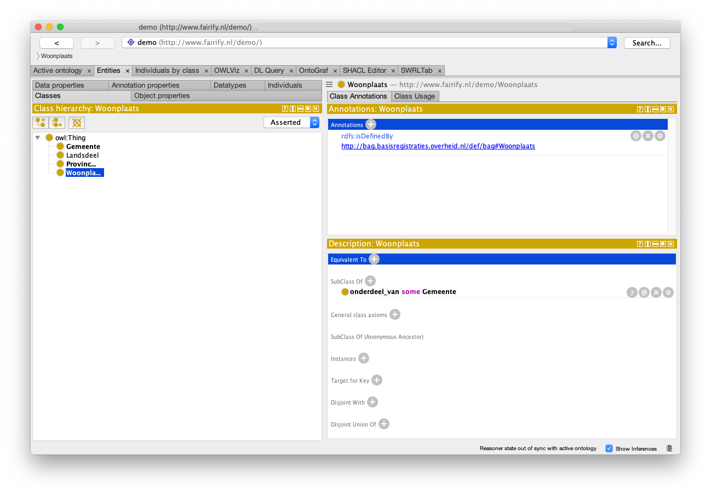

De ontologie bevat vier klassen voor de verschillende instanties van woonplaats, gemeente, provincie en landsdeel. Twee objectproperties (die elkaars tegengestelde zijn), beide transitief, die aangeven: woonplaats 'onderdeel_van' gemeente en gemeente 'heeft_onderdeel' woonplaats.

Deze uitleg is wel heel erg summier, maar omdat deze tutorial niet over ontologieën gaan, laat ik het hierbij. De ontologie is nodig om in Karma de triples te kunnen genereren.

## Karma
Volg de aanwijzingen op de Github site van Karma voor de installatie. Nadat je Karma opstart heb je als het goed is een browser scherm met daarin de link naar Karma (waarschijnlijk localhost:8080).
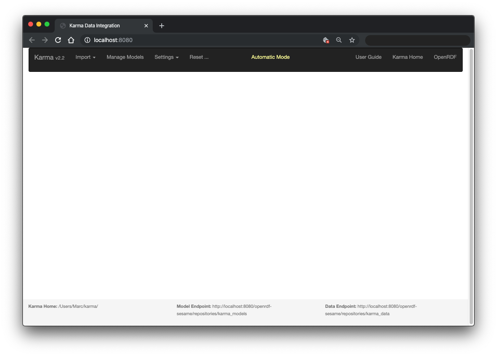
Eerste stap is het importeren van de ontologie, zodat Karma weet welke Klassen en eigenschappen er zijn om Linked Data mee te maken.
Kies menu (bovenin scherm) Import - From File. Er opent dan een Verkenner (Windows) of Finder (Mac) waarin je de juiste ontologie kiest. In dit voorbeeld kiezen we dus het bestand 'woonplaatsen in nederland.owl'.

Karma detecteerd zelf dat het een OWL Ontology betreft. Je bevestigt dit door op 'Next' te klikken. En vervolgens klik je op 'Import'. De encoding is inderdaad 'Unicode UTF-8'. Als het goed is wordt rechts bovenin het scherm bevestigd 'Ontology successfully imported'. Verder verandert er nog niets aan de interface.

Nu is het tijd om de data te importeren. Je kiest weer het menu Import - From File. En nu selecteer je de CSV met plaatsen. In dit geval bevestig je het file formaat 'CSV Text File', kies 'Next'. De import opties verschijnen.

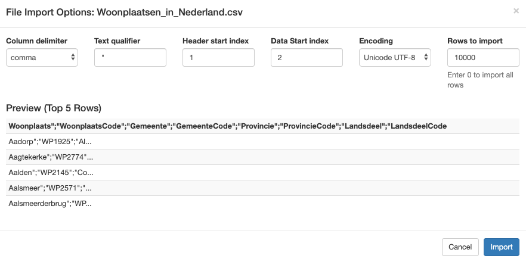

De 'Column delimiter', het scheidingsteken tussen de kolommen, moet je veranderen van 'comma' naar 'semicolon'. Komma en Puntkomma zijn de twee meest voorkomende formaten. In dit voorbeeld zie je nu al meteen dat de andere opties goed staan, omdat de voorbeeld-tabel nu correct wordt weergegeven. Als je de data van het CBS niet hebt aangepast (kopteksten), kun je hier met de optie 'Data Start index' het juiste regelnummer aangeven waarop de echte data begint. Ook had je in dat geval aan kunnen geven dat de 'Header start index' op regel 3 staat.

De Encoding staat reeds correct. Kijk ook nog even naar 'Rows to import'. Hier kun je het aantal regels aanpassen. Dat kan handig zijn voor de eerste stap, omdat de performance dan goed blijft en je makkerlijker overzicht houdt als je nog aan het testen bent. Voor deze tutorial maken we hier ook een tussenstap. Kies ervoor om allen de eerste drie rijen te importeren. Omdat de data in de verschillende rijen heel consistent is heeft het weinig meerwaarde meer rijen te nemen. Als we de uiteindelijke data aan gaan maken importeren we uiteraard alle rijen. Na het wijzigen van de instellingen, klik op 'Import'
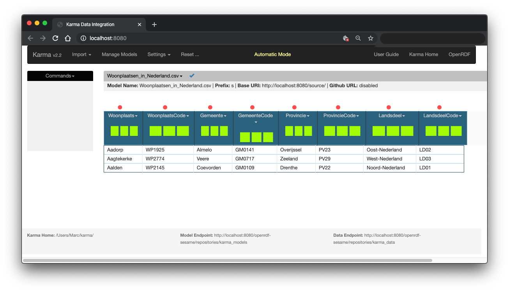
Je zit nu bovenstaande scherm met de geïmporteerde data. De groene balkjes geven de distributie van de data in die kolom aan. Voor deze data niet zinvol, maar als je bijvoorbeeld getallen in de data hebt, kun je aan de groene balkjes in één oogopslag zien of de data normaal of uniform verdeeld is.

We kunnen nu per kolom aan gaan geven hoe de gegevens in deze kolom omgezet moeten worden. De volgorde en manier waarop kun je volledig zelf bepalen. De onderstaande volgorde is niet meer dan mijn persoonlijke voorkeur. Pak de volgorde dus vooral op een andere manier aan als je dat handiger vindt.

### Stap 1: URI's maken
Als eerste stap gaan we de Unique Resource Identiefiers (URI's) aanmaken voor de verschillende instanties.
De eerste is voor de woonplaatsen. Je zoekt dat een uniek gegeven dat je kunt gebruiken om een URI te maken. In dit geval ligt de woonplaatscode wel erg voor de hand. Deze is gegarandeerd uniek. Bovendien kun je door deze slim te kiezen direct een URL krijgen die werkt als je hem invoert in je browser.

Voorbeeld: http://bag.basisregistraties.overheid.nl/bag/id/woonplaats/1925. Deze linkt open de referentie naar de woonplaats Aadorp bij het kadaster. Deze link zullen we gebruiken bij het aanmaken van onze Linked Data. We hebben daarvoor de woonplaatscode nodig, behalve het voorvoegsel 'WP'. Het getal is het laatste deel van de URL die we willen gebruiken als URI.

Klik hiervoor op de pijl naast de titel "WoonplaatsCode" van de tweede kolom. Er opent een dropdown menu. Kies voor de optie 'PyTransform'. Je krijgt vervolgens een popup window waarin je met behulp van de taal Python de inhoud van de kolom kunt manipuleren. Het resultaat van de manipulatie kun je vervolgens in een nieuwe kolom opslaan. Ook kun je de inhoud van de bestaande kolom vervangen. Om rare fouten en moeilijk herstel te voorkomen is mijn tip om altijd te kiezen voor de eerste optie. Hiervoor type je de naam van de nieuwe kolom. Wij gaan voor 'woonplaats_uri'.

In het middels invul deel staat de code die de waarde gaat bepalen. Nu staat daar: 

```return getValue("WoonplaatsCode")```

Dit betekent simpelweg: neem de waarde uit de kolom met de naam "WoonplaatsCode" en geef deze terun (return). Als je deze code vervangt door ```return "Hello World"``` en vervolgens klikt op "Preview results for top 5 rows" zie je drie keer "Hello World" staan, omdat er maar drie rijen data zijn.

In ons voorbeeld willen we twee stappen uitvoeren met de data:
1. code krijgen, zonder het voorvoegsel "WP"
2. de URL voorvoegen waardoor de link verwijst naar het kadaster

We doen dit met de volgende instructie:
1. ```getValue("WoonplaatsCode")[2:]``` Door [:2] toe te voegen, halen we de eerste twee karakters weg.
2. ```return 'http://bag.basisregistraties.overheid.nl/bag/id/woonplaats/' + ```. Door dit toe te voegen geven we eerste de 'string' met de URL terug en dan '+' de waarde uit de eerste stap.

De hele instructie wordt dan:

```return 'http://bag.basisregistraties.overheid.nl/bag/id/woonplaats/' + getValue("WoonplaatsCode")[2:]```

Door op de Preview te klikken kun je het resultaat zien. Het scherm ziet er nu als volgt uit:

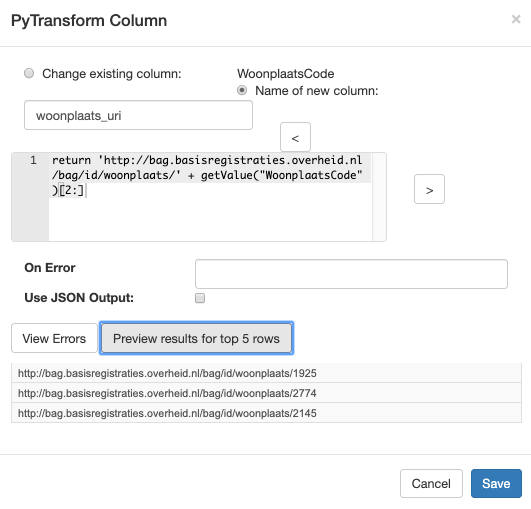

Klik 'Save' om te bevestigen. Naast de kolom WoonplaatsCode, verschijnt nu een extra kolom 'woonplaats_uri', met een afwijkende kleur.

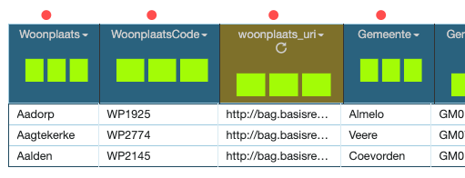

Van deze kolom gaan we nu aangeven dat het de URI is van instanties uit de klasse Woonplaats. We doen dat door op het dropdown-pijltje te klikken in de nieuwe kolom en te kiezen voor de bovenste menu optie 'Set Semantic Type'. Vervolgens klik je op de 'Edit' knop die staat achter de optie '*uri* of Class'.

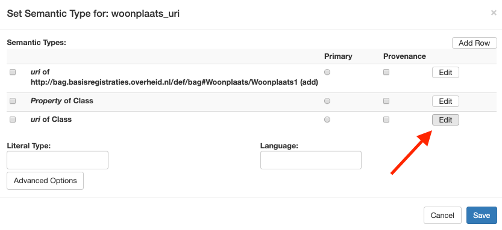

Vervolgens kies je uit de lijst onder 'Class' de juiste klasse uit de ontologie. In dit geval 'http<nolink>://www.fairify.nl/demo/Woonplaats/Woonplaats1 (add)' en klik op 'Save'. Het deel (add) slaat op het feit dat voor iedere nieuwe regel een nieuwe instantie van dit type wordt aangemaakt. Als je op basis van dezelfde regel in het bestande, maar een andere kolom, een tweede instantie aan wilt maken van hetzelfde type, wordt het nummer achter Woonplaats opgehoogd (naar 2 in dit geval dus). Voor dit simpele voorbeeld maken we hier geen gebruik van. Hieronder zie je het resultaat van de eerste stap.
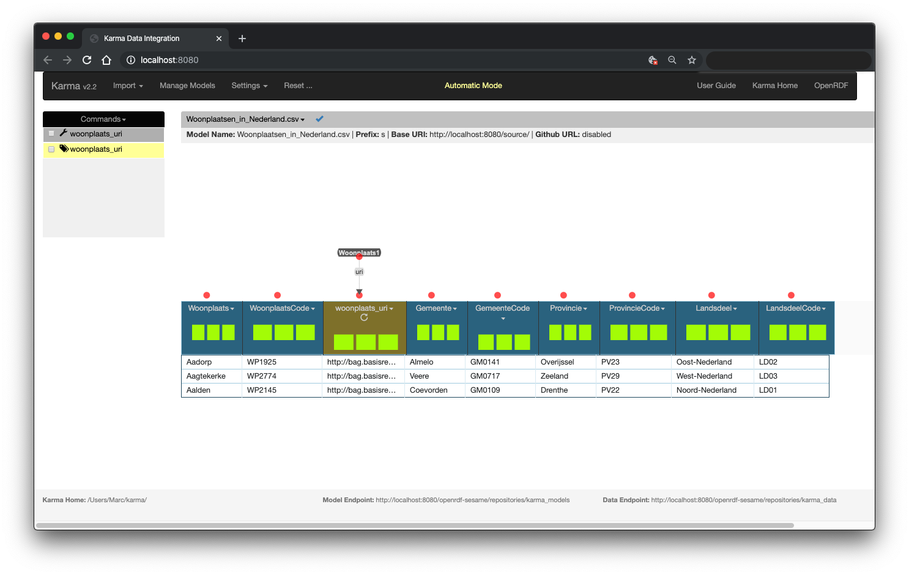
Hebben we nu al Linked Data, zou je je af kunnen vragen. Het antwoord is ja! Als je klikt op het dropdown pijlt naast de Woonplaatsen_in_Nederland.csv text, vervolgens kiest voor 'Publish' en dan voor 'RDF', kun je de tot nu toe gemaakte Linked Data 'publiceren'. Er wordt je gevraagd om een RDF Graph aan te maken, of een bestaande te kiezen als je er al eerder een hebt aangemaakt. Je vult nu een willekeurige URL in, die verwijst naar een 'named graph' binnen een 'triple store'. Termen waarvoor het nu wat ver gaat om deze in detail uit te leggen.

In het kort:
* triple store, kun je zien als een database waarin je Linked Data (triples!) op kunt slaan
* (named) Graph, kun je zien als een tabel in de triple store. Enigzins verwarrend omdat het iets anders is dan een tabel in een database omdat we bij Linked Data geen tabellen gaan koppelen met sleutels o.i.d. Voor nu is het voldoende te onthouden dat het een identifier is binnen de triple store.

Kies nu of de data wilt vervangen of toevoegen (maakt de eerste keer natuurlijk geen verschil). Vervolgens zie je in het overzicht scherm naast de naam van het bestand in het blauw RDF staan met een vinkje ernaast. Als je daarop klikt zie je de Linked Data die je hebt gemaakt.

```
<http://bag.basisregistraties.overheid.nl/bag/id/woonplaats/1925> <http://www.w3.org/1999/02/22-rdf-syntax-ns#type> <http://www.fairify.nl/demo/Woonplaats> .
<http://bag.basisregistraties.overheid.nl/bag/id/woonplaats/2774> <http://www.w3.org/1999/02/22-rdf-syntax-ns#type> <http://www.fairify.nl/demo/Woonplaats> .
<http://bag.basisregistraties.overheid.nl/bag/id/woonplaats/2145> <http://www.w3.org/1999/02/22-rdf-syntax-ns#type> <http://www.fairify.nl/demo/Woonplaats> .
```
Wat lastig leesbaar omdat de tekst zo lang wordt door de URI's. Binnen Linked Data is daar een oplossing voor, namelijk het gebruik van prefixes voor herhalende lange URL's. Ook hier weer: zonder daar diep op in te gaan...... ziet de data er met prefixes zo uit:

```
@prefix bag:<http://bag.basisregistraties.overheid.nl/bag/id/woonplaats/>
@prefix rdfs:<http://www.w3.org/1999/02/22-rdf-syntax-ns#>
@prefix demo:<http://www.fairify.nl/demo/>

bag:1925 rdfs:type demo:Woonplaats .
bag:2774 rdfs:type demo:Woonplaats .
bag:2145 rdfs:type demo:Woonplaats .

```
De betekenis van deze drie triples is nu eenvoudig. De resources met de URI's die starten met de prefix van bag: en eindigen op resp. 1925, 2774 en 2144, zijn alledrie van het 'type' Woonplaats volgens de demo ontologie. En dat was natuurlijk precies wat we bedoelden aan te geven.

De volgende twee stappen zijn het toevoegdn van de informatie uit de eerste twee kolommen aan deze, net aangemaakte, instanties van het type Woonplaats. De eerste kolom vormt het label dat voor mensen handig is om te lezen. De tweede vormt de code die we aangeven met de dataproperty "woonplaats_code" zoals aangemaakt in de ontologie.

* Kies de dropdown-pijl naast de kolom "Woonplaats" en selecteer "Set Semantic Type"
* Klik op "Edit" naast de keuze "*Property* of Class"
* Kies als Property: rdfs:label
* Kies als Class: http<nolink>://www.fairify.nl/demo/Woonplaats/Woonplaats1 (let op dat hier nu geen 'add' achter staat, omdat deze klasse al instanties heeft)
* Klik op 'Save'

In het overzicht zie je nu een verbinding van kolom 1 naar het item 'Woonplaats1". De verbinding heeft de naam 'label'.

Voor de tweede kolom:
* Kies de dropdown-pijl naast de kolom "WoonplaatsCode" en selecteer "Set Semantic Type"
* Klik op "Edit" naast de keuze "*Property* of Class"
* Kies als Property: http<nolink>://www.fairify.nl/demo/woonplaats_code
* Kies als Class: http<nolink>://www.fairify.nl/demo/Woonplaats/Woonplaats1 
* Klik op 'Save'

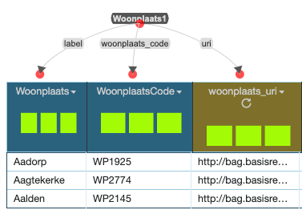

Door weer te kiezen voor het publiceren van de RDF data en de huidige data te vervangen (Replace Existing Data) kun je de nieuwe RDF data bekijken. Met prefixes voor de leesbaarheid, ziet de data er nu als volgt uit (de volgorde kan anders zijn, maar dat maakt niets uit)
```
@prefix bag:<http://bag.basisregistraties.overheid.nl/bag/id/woonplaats/>
@prefix rdfs:<http://www.w3.org/1999/02/22-rdf-syntax-ns#>
@prefix demo:<http://www.fairify.nl/demo/>

bag:1925 rdfs:type demo:Woonplaats .
bag:1925 rdfs:label "Aadorp" .
bag:1925 demo:woonplaats_code "WP1925" .

bag:2774 rdfs:type demo:Woonplaats .
bag:2774 rdfs:label "Aagtekerke" .
bag:2774 demo:woonplaats_code "WP2774" .

bag:2145 rdfs:type demo:Woonplaats .
bag:2145 rdfs:label "Aalden" .
bag:2145 demo:woonplaats_code "WP2145" .
```

Dezelfde stappen als die we hebben gezet voor woonplaats, kunnen ook gezet worden voor gemeente, provincie en landsdeel. Het verschil is slechts de basis URL en de eigenschap voor de code.

Daarnaast is er een verschil in de dataopbouw. Immers, in het bronbestand komt iedere plaats maar één keer voor. Maar een gemeente komt voor bij iedere plaats die erin ligt. Provincies komen nog vaker voor en lansdelen worden het vaakst herhaald in de data. Hoe gaat Karma daarmee om? Simpel: voor iedere regel die herhaalt, wordt dezelfde Linked Data nogmaals herhaald. Gelukkig gaan de meeste triple stores hier goed mee om: een herhalend statement, wordt slechts één keer ingeladen. En zelfs bij triples stores waar dat niet het geval is, blijft de 'schade' beperkt tot wat extra disk-/geheugenruimte. Functioneel verandert er niets als je hetzelfde statement meerdere keren maakt.

Nadat alle stappen zijn herhaald voor gemeente, provincie en landsdeel, ziet het overzicht er als volgt uit, waarbij het landsdeel er een beetje 'bij-zweeft', omdat dat er niet in de breedte op past.
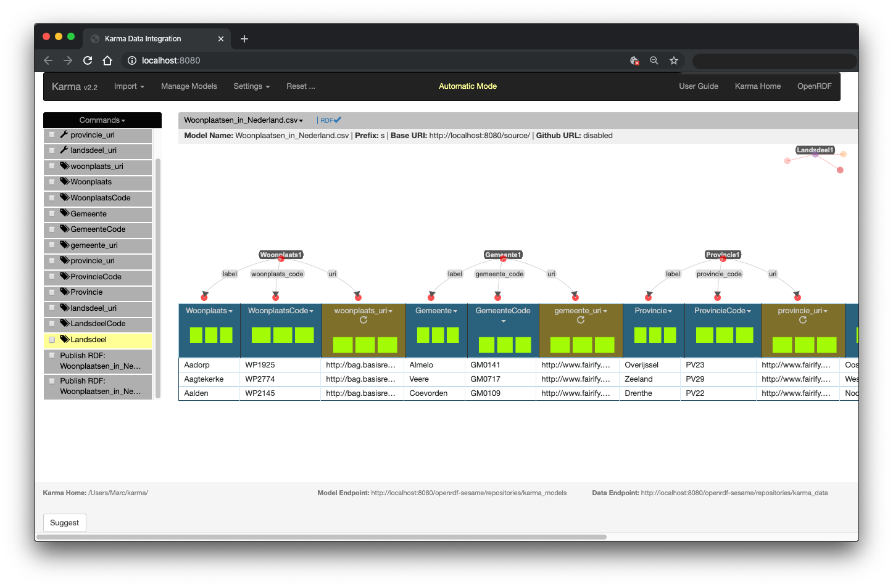
Op dit moment maken we allemaal triples aan voor de plaatsen, gemeenten, provicies en landsdelen. Maar er ontbreekt nog wat. De verbinding tussen deze 'dingen'. Die maken we aan met de object propertie uit de ontologie: onderdeel_van.

Voor woonplaatsen willen we de link 'onderdeel_van', laten (ver)wijzen naar de gemeente. Je doet dit door op het donkere label met "Woonplaats1" te klikken en vervolgens de kiezen voor "Add Outgoing Link". De keuze tussen outgoing en incoming bepaalt de richting van de pijl. Aangezien de pijl "onderdeel_van" wijst van woonplaats NAAR gemeente, is dit vanuit de woonplaats gezien en outgoink link. Je kunt dezelfde relatie ook aanmaken vanuit gemeente. Dat voeg je daar een incoming link toe. Dat heeft precies hetzelfde effect....

Terug naar het voorbeeld. Nadat je op Add Outgoing Link hebt geklinkt, moet je de property (de pijl) en de Klasse waarnaar de pijl verwijst aangeven. Kies bij 'To Class' voor de gemeente klasse en voor de property de property 'onderdeel_van'. En kies dan voor 'Save'.

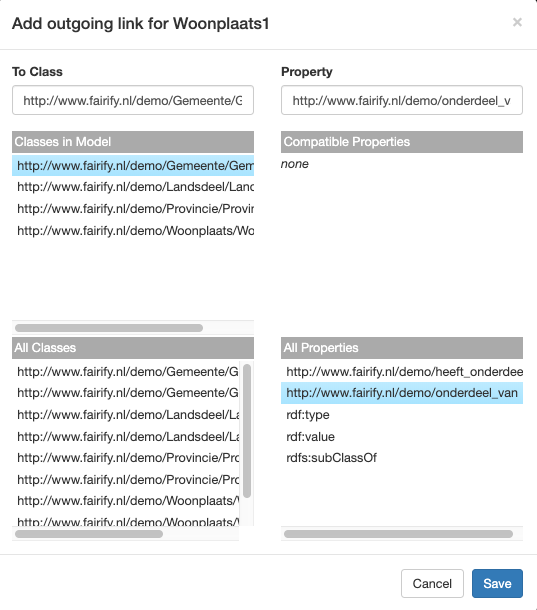

Je ziet nu dat Woonplaats1 en Gemeente1 zijn gekoppeld door de relatie 'onderdeel_van'.

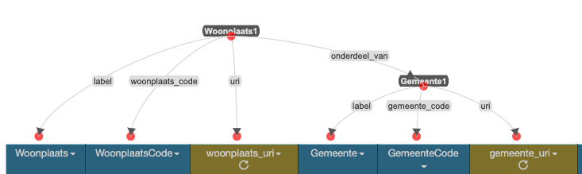

Hetzelfde doe je vanuit gemeente naar provincie en van gemeente naar landsdeel. Als we nu opnieuw kiezen voor het publiceren van de data, krijgen we alle Linked Data die we nodig hebben. Door vervolgens rechts te klikken op het blauwe 'RDF' en te kiezen voor 'Link opslaan als', kun je de gegenereerde Linked Data opslaan in het zogenaamde Turtle (*.ttl) formaat. Kies een handige naar voor het bestand en sla de data op.

### Model bewaren
In Karma staat aan de linkerkant van het scherm alle acties (onder 'Commands') die we uit hebben gevoerd. Zowel het toevoegen en bewerken van kolommen, als het leggen van de juiste verbindingen en definities van Klasssen. We willen deze acties opslaan, zodat we deze niet opnieuw in hoeven voeren als we een nieuwe versie van ons bronbestand krijgen. Of, zoals in ons voorbeeld, als we de stappen nog moeten doorvoeren op álle regels uit het bronbestand. Nu hebben we immmers alleen nog maar de linked data voor drie plaatsen.

Om het model op te slaan, moete we dit eerst (net als met de triples) publiceren. Je doet dit door rechts te klikken op de dropdown-pijl naast de betandsnaan Woonplaatsen_in_Nederland.csv. Kies vervolgens voor Publish en dan voor Model. Je krijgt nu twee extra links naast de 'RDF' link, nl. Report en R2RML Model. Dat laatste is het model dat we gemaakt hebben in de taal R2RML.

[R2RML](https://www.w3.org/TR/r2rml/) is een W3C standaard taal om de mapping van relationele databases naar RDF (of Linked Data) te beschrijven. Zoals je hebt gezien kun je dit ook gebruiken voor CSV data. Maar je kunt dus veel meer met deze taal.

Het model wordt door Karma zelf opgeslagen, maar in mijn ervaring is dit proces niet vrij van bugs. Ik raad je dan ook aan het model ook zelf op te slaan in een apart bestand. Je doet dit door rechts te klikken op de link R2RML Model en dan te kiezen voor 'Link opslaan als' en vervolgens en bestandsnaam te kiezen. Default wordt de naam van het bronbestand gekozen met de toevoeging '-model.ttl'. En ja, het model zelf wordt ook als Linked Data opgeslagen. En je kunt het model dus ook in een triple store laden. Precies wat Karma zelf ook doet. Wij gaan echter in de volgende stap uit van het bestand dat we net op hebben geslagen.

### Alle data omzetten
We zijn nu klaar om alle data om te zetten naar Linked Data door gebruik te maken van het model. Hiervoor kun je Karma gebruiken zoals we dat tot nu toe gedaan hebben, maar er zijn meerder mogelijkheden. Wij gaan door met Karma. Je kunt de oude 'import' van de eerste drie regels gewoon laten staan. Verwijderen kan ook; wat je zelf wilt.

* Kies opniew voor de menuoptie 'Import' en dan voor 'From File'.
* Verander de delimiter weer naar 'semicolon'
* Geef bij Rows to import aan '0'. Nu weet je zeker dat alle rijen worden geïmporteerd

Nu moeten we het model gaan toepassen dat we zojuist hebben opgeslagen.
* Klik op de dropdown-pijl naast de bestandsnaam
* Kies voor 'Apply R2RML Model en vervolgens voor 'From File'
* Kies nu het bestand waarin je het model hebt opgeslagen. Waarschijnlijk Woonplaatsen_in_Nederland.csv-model.ttl

Het model wordt nu toegepast en je ziet de extra kolommen verschijnen en de pijltjes boven de kolommen met de relaties. Je wilt nu de data als RDF data opslaan.
* Klik op de dropdown-pijl naast de bestandsnaam
* Kies voor Publisch en dan voor RDF
* Replace Existing Data ligt nu voor de hand (als je alles precies hebt gevolgd zal de data in dezelfde Graph worden gezet als de data van de drie plaatsen die we eerder hebben gemaakt).
* Nu kun je de triples opslaan door rechts te klikken op het blauwe 'RDF' naast de bestandsnaam. Kies 'Link opslaan als' en kies de naam waaronder je de Linked Data wilt opslaan.