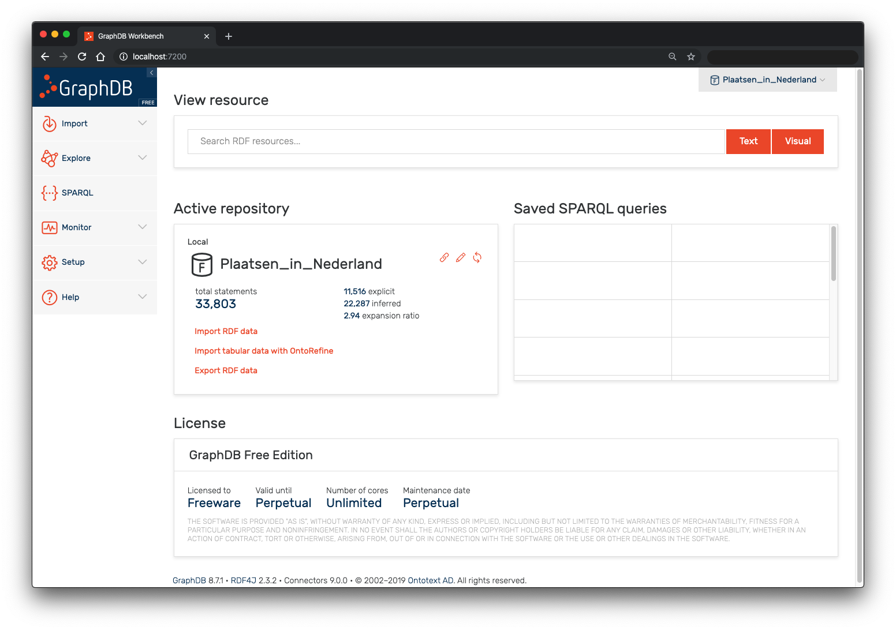
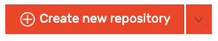
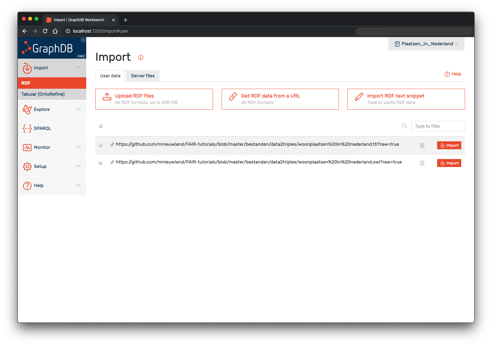
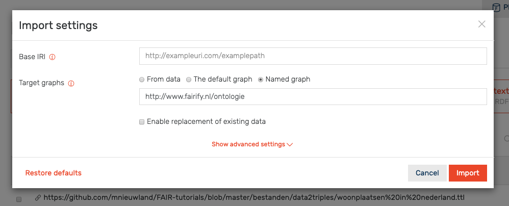
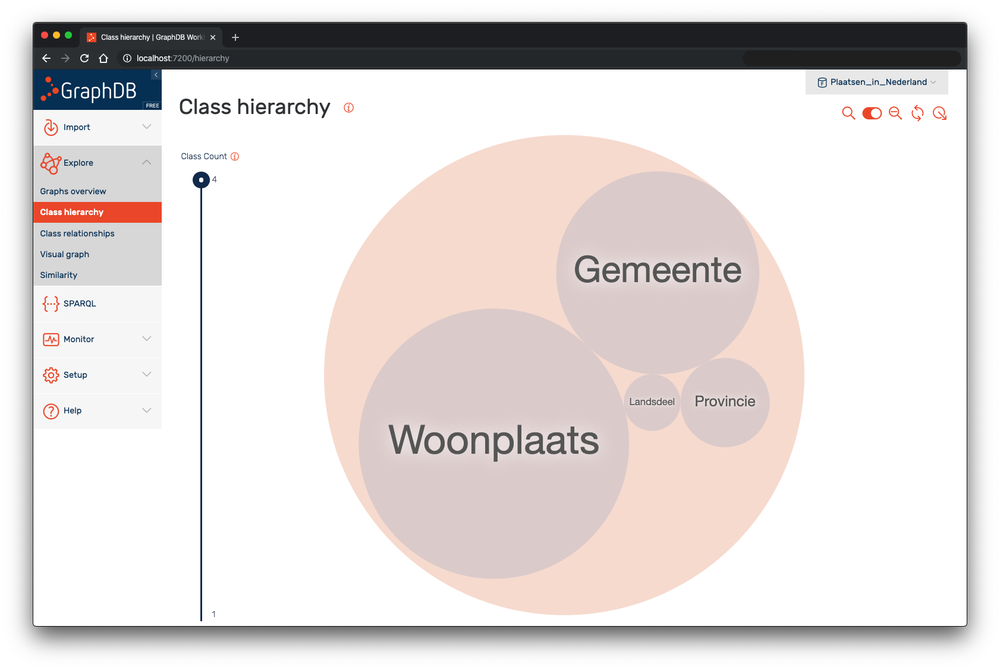
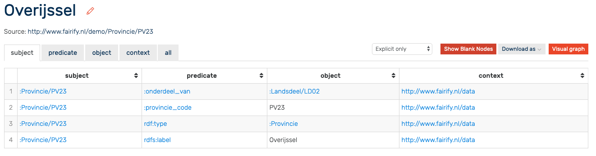
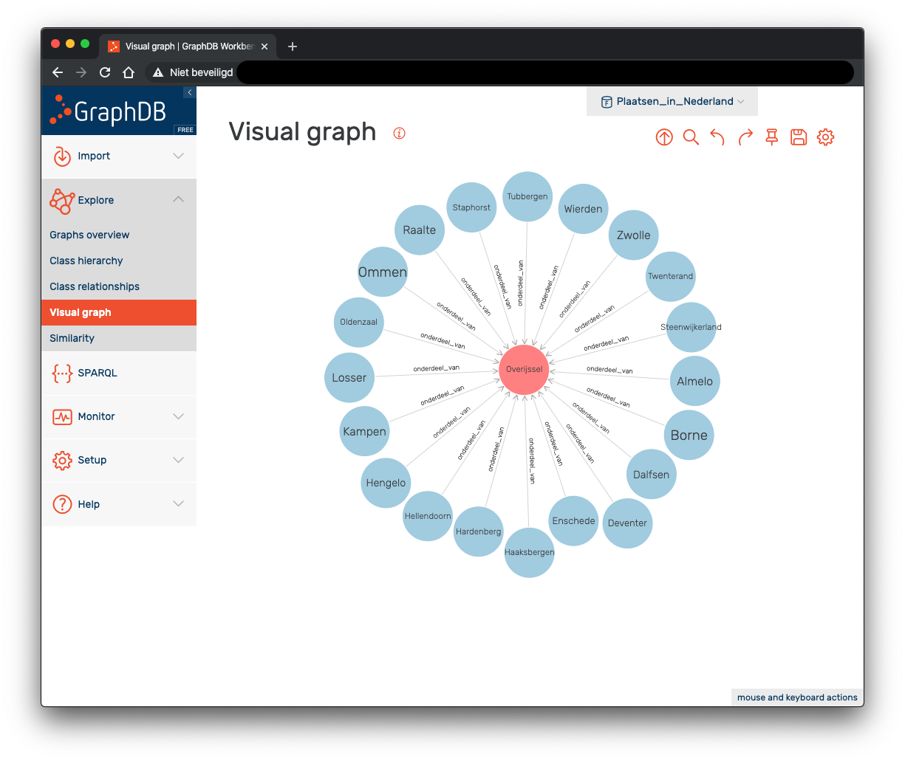
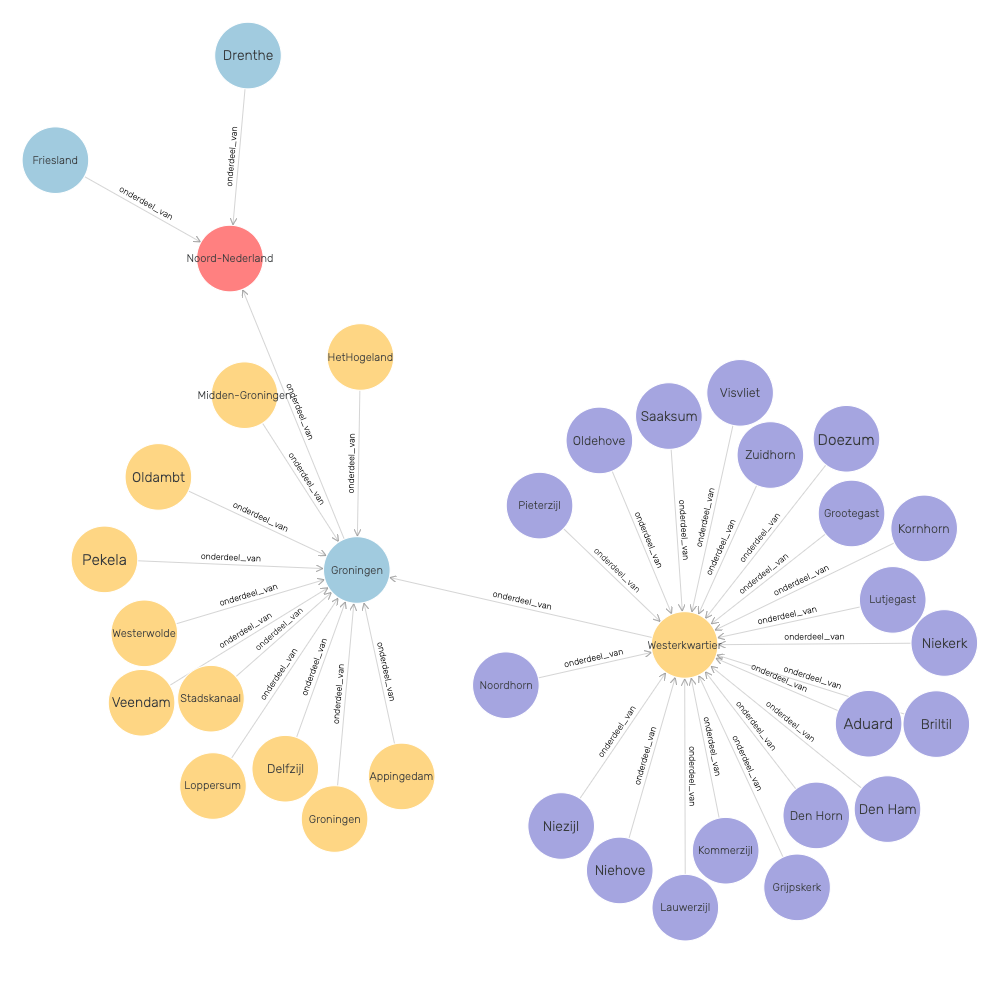

# Linked Data opslaan en gebruiken
In deze tutorial gaan we een Graph Store installeren, zodat we Linked Data op kunnen slaan en kunnen gebruiken. We maken gebruik van [GraphDB Free](http://graphdb.ontotext.com/), de Free edition. Er zijn meerdere prima triple, of graph stores beschikbaar, vele als open source. Ze hebben elk hun eigen voor- en nadelen. Deze tutorial is niet bedoeld om een overzicht te geven van alle verschillende stores, ook niet om ze te vergelijken en al helemaal niet om de beste te kiezen.

De reden om te kiezen voor GraphDB is dat deze een beheer-interace biedt die uitgebreid is en makkelijk te begrijpen. Het is dus vrij intuitief te gebruiken. Daarnaast biedt GraphDB een eenvoudige manier om triples te visualiseren die erg handig is om derden te laten zien (letterlijk) hoe Linked Data in elkaar zit. Ook is reasoning op een manier ingebouwd dit ik persoonlijk erg prettig en gebruiksvriendelijk vind. Het is het eenvoudig om met meerdere 'graphs' naast elkaar te werken. Tenslotte kun je met GraphDB op een eenvoudige manier gebruikers aanmaken die jouw Linked Data kunnen bekijken/bewerken.

Als alternatieven voor GraphDB kun je bijvoorbeeld kijken naar [Virtuoso](http://vos.openlinksw.com/) (érg uitgebreid) of [Fuseki](https://jena.apache.org/documentation/fuseki2/) (erg eenvoudig). Maar er zijn er veel meer.
## Installatie
Voor de installatie verwijs ik je naar de [quick start guide](http://graphdb.ontotext.com/documentation/free/quick-start-guide.html), waar niet alleen de installatie staat beschreven, maar ook een mooie overview van de basis functies. Deze tutorial zal deels overlappen met wat in de quick start guide ook al netjes beschreven wordt. Als iets niet duidelijk is in deze tutorial, of je wilt meer details over ingewikkelde functies dan is de documentatie bij GraphDB hiervoor zeer geschikt.
Ik ga ervan uit dat je de instructies heb opgevolgd tot het moment dat je GraphDB kunt 'openen' in je browser.

In bovenstaande voorbeeld is al een repository aangemaakt voor de data die in de vorige tutorial is gecreëerd, maar direct na installatie is dat natuurlijk nog niet het geval. De eerste stap is dan ook een repository aanmaken. Een repository kun je zien als aparte locatie waarin je Linked Data kunt opslaan. We zullen straks zien dat je binnen één repository meerdere graphs kunt opslaan.
# aanmaken repository
Ga naar Setup -> Repositories en klik op Create new repository.



Vervolgens kun je verschillende opties aangeven, waarbij de default waarden prima werken voor deze tutorial.
Geef de Repository ID aan, in deze tutorial gebruiken we 'Plaatsen_in_Nederland'.
Optioneel kun je een naam aangeven die bijvoorbeeld het gebruik van spaties toestaat, wat niet kan bij de ID.
Eén andere optie geef ik hier nog wat aandacht: Ruleset. Hiermee wordt bepaald of reasoning mogelijk is en zo ja, volgens welke regels. GraphDB biedt hiervoor een uitgebreide keuze. Het onderscheid is vaak subtiel en in ieder geval complex. Voor de tutorial kiezen we voor RDFS-Plus (Optimized). Deze rule-set ondersteunt RDFS (belangrijkste punt: bewust van subklassen) en inverse, transitieve en symmetrische opbject properties. Meer informatie vind je [hier](http://graphdb.ontotext.com/documentation/free/reasoning.html).

Klik op 'Create' om het aanmaken van de repository te bevestigen.
# Linked Data toevoegen
Door in het linker menu te kiezen voor Import -> RDF, of door vanuit het overzicht scherm bij de actieve repository te klikken op 'Import RDF data', kun je Linked Data in de vorm van RDF triples toevoegen.

Je kunt data uploaden in de vorm van een bestand (in vele formaten, zoals zichtbaa is als je met de muis over Upload RDF files beweegt), via een een URL of door text te plakken. In dit geval kunnen we gebruik maken van de triples die hier op Github onder de bestanden staat, of je gebruikt het bestande op je eigen computer als je de vorige tutorial gevolgd hebt.
Klik op 'Get RDF data from URL' en plak deze link: 

https://raw.githubusercontent.com/mnieuwland/FAIR-tutorials/master/bestanden/data2triples/woonplaatsen%20in%20nederland.ttl

Als je 'start import automatically' uitvinkt kun je relevante opties later ingeven. Klik nogmaals op 'Get RDF data from URL' om de ontology te uploaden via deze link:

https://raw.githubusercontent.com/mnieuwland/FAIR-tutorials/master/bestanden/data2triples/woonplaatsen%20in%20nederland.owl

Je ziet nu het volgende scherm. 
Vanuit dit scherm kun je meerder bestanden in 1x importeren, maar wij gaan ze per stuk importeren, omdat we beide datasets in hun eigen graph willen opslaan. Klik op 'import' achter het .owl bestand (bestand met de ontologie). In de import settings geven we handmatig een "Target graph" aan, door te kiezen voor 'Named graph'. Type vervolgens een (willekeurige) naam voor deze graph. En klik op Import om de data in de repository te laden.



Door de twee bestanden in hun eigen graph te zetten wordt het beheer van de data eenvoudiger. Je kunt alle data uit een graph bijvoorbeeld makkelijk wissen en updaten met een nieuwe versie. Ook kun je bij het queryen van de data expliciet aangeven dat je alleen maar de data uit een specifieke graph wilt gebruiken. Als je niets aangeeft, wordt de data van alle graphs in een repository gewoon als geheel behandeld. Je hoeft dus niets extra's te doen om de data te 'koppelen', maar het scheiden gaat erg eenvoudig.

Herhaal deze stap voor de dataset met de data (.ttl bestand) en geef deze een andere naam voor de Named graph. De data zit nu de repository.
## Data verkennen
We kunnen de data nu op verschillende manieren bekijken. Een overzicht van de Klassen in de data krijg je door de te klikken op Explore -> Class hierarchy.

Hier kun je zien dat er 4 verschillende klassen in de data aanwezig zijn. De meeste data gaat over Woonplaats en de minste over Landsdeel. Als je op een klasse klikt, krijg je een aantal instanties uit die klasse te zien, waarop je weer klikken kunt. Klik op de klasse Provincie en je ziet de 12 provincies in Nederland met een link. Klik nu op de link :Provincie/PV23 en je krijgt de volgende tabel:



In de tabel zie alle triples in de repository waarvan :Provincie/PV23 het 'subject' is. Je kunt met de tabbladen er ook voor kiezen om alle triples te zien waarvan de resource het 'predicate' of het 'object' is. De andere tabbladen zijn:
* context: alle triples waarvoor de resource overeenkomt met de Named Graph waarin triples zitten (hebben we een waarde gegeven bij het importeren van de data). Je krijgt in dit geval dan alle data die in de Named Graph zit met de URI http://www.fairify.nl/demo/Provincie/PV23. In ons bestaat deze niet en krijg je dus geen triples te zien.
* all: alle triples waarin de URI http://www.fairify.nl/demo/Provincie/PV23 voorkomt. Of correcter gezegd: alle quads waarin de URI http://www.fairify.nl/demo/Provincie/PV23 voorkomt.. De combinatie van een triple, inclusief de context (ofwel de Named Graph) wordt nl. ook wel een quad genoemd. Dat is feitelijk wat je ziet in de tabel in bovenstaand figuur.

Naast de tabbladen kom je een dropdown tegen die standaard op 'Explicit only' staat. De betekenis is als volgt:
* Explicit only: alle triples die expliciet(!) in de data vermeld staan
* Implicit only: alle triples die niet expliciet in de data staan, maar op basis van reasoning geconcludeerd kunnen worden. Zo staat nergens in de data dat de de provincie Overijssel de gemeente Zwolle als onderdeel heeft. Maar omdat heeft_onderdeel in de ontologie uitgelegd wordt als de omgekeerde van onderdeel_van en in de data wel staat: Zwolle -----onderdeel_van-----> Overijssel, kun je concluderen dat Overijssel -----heeft_onderdeel-----> Zwolle. Deze triple zie dus bij Overijssel als subject en de keuze 'Implicit Only'.
* Explicit and Implicit: uiteraard de optie om beide te zien. Let op dat de impliciete triples allemaal als context 'http://www.ontotext.com/implicit' krijgen.

Vervolgens kom je het symbool  tegen. Hier kun je schakelen tussen wel of niet 'Expand results over owl:sameAs". Als deze optie aanstaat zullen alle instanties die gekoppeld zijn via de OWL eigenschap sameAs als dezelfde instantie worden beschouwd. Stel dat er in de repository ook data zit die een andere URI gebruik voor de provincie Overijssel, bijvoorbeeld omdat je data uit [Wikidata](https://www.wikidata.org/wiki/Wikidata:Main_Page) combineert. Je kunt dan een triple opnemen die er als volgt uitziet:

http://www.wikidata.org/entity/Q773 -----owl:sameAs----> http://www.fairify.nl/demo/Provincie/PV23

Vervolgens behandelt GraphDB beide instaties als iedentiek. Ieder eigenschap die je aan de ene toekent, wordt dan automatisch ook een eigenschap van de andere. Het is een krachtig mechanisme, dat je met beleid moet toepassen, omdat je een ander de 'macht' geeft om eigenschappen van 'jouw' instantie te veranderen. Weliswaar via een omweg, maar een tip is om dit alleen toe te passen als je zeker bent van de gelijkenis. Als per ongeluk de plaats Utrecht gelijk maakt aan de provincie Utrecht in een andere dataset kun je rare conclusies krijgen over je data.

De optie 'Show Blank Nodes' spreekt voor zich en laat je schakelen tussen het wel of niet laten zien van Blank Nodes. De meeste bronnen zullen je adviseren om geen Blank Nodes te gebruiken in je data, maar in een OWL ontologie kun je er al bijna niet omheen, omdat het voor allerlei statements wordt gebruikt. Het maakt gewoon onderdeel uit van de taal.

Omdat Blank Nodes een URI hebben, kun je er dus niet op 'klikken' om meer informatie te krijgen. Je kunt via SPARQL wel degelijk informatie over Blank Nodes krijgen (uiteraard, anders had je er niets aan), maar ze zijn niet erg makkelijk te doorzien. Ze weglaten in een tabel kan dus beter leesbare informatie opleveren.

De 'Download as' knop spreekt ook voor zich. Het resultaat uit de tabel kun je in verschillende formaten opslaan.

De laatste knop in dit rijtje is 'Visual graph'. Deze biedt de mogelijkheid om je instantie visueel weer te geven. In dit geval dus de provincie Overijssel.

Je ziet hier de provincie Overijssel met alle gemeenten die onderdeel zijn van Overijssel. Op iedere instantie kun je weer dubbelklikken. Door op deze manier door je data te klikken krijg je 'gevoel' voor je data en Linked Data in het algemeen. Het is in mijn ervaring ook een goede manier om te kijken of je data voldoet aan je verwachten. Eventuele fouten in de data is ook snel te krijgen.



GraphDB geeft iedere instantie van een ander type, een andere kleur. Zo zie je hierboven dat de kleur rood staat voor het type Landsdeel, blauw voor provincie, geel voor gemeente en paars voor plaats. Als je op een andere manier de data begint te verkennen, kunnen de kleuren anders verdeeld worden.

In de bolletjes (de instanties) zet GraphDB het label van die instantie. De URI zou immers niet echt leesbaar zijn. Je kunt de taal van de labels die weergegven wordt instellen door op het instellingen symbool te klikken. Je kunt in de instelling ook kiezen om 'Inferred Statements' te laten zien. Dit komt overeen met de impliciete data. Er zijn veel meer instellingen mogelijk. Voor deze tutorial gaat behandeling daarvan te ver.

Naast de instellingen via het menu is het zelf mogelijk om precies het gedrag van Visual graph zelf te bepalen: welke relaties zijn wel/niet zichtbaar, welke kleuren worden gebruikt, bolletjes kunnen groter gemaakt worden a.h.v. bepaalde eigenschappen, etc. etc. Zie [hier](http://graphdb.ontotext.com/documentation/9.0/free/exploring-data.html#explore-resources) voor meer informatie.
## Data queryen
Tot nu toe hebben we alleen naar de data gekeken in de vorm zoals deze is toegevoegd, of zoals door reasoning geconcludeerd kan worden. Om data samen te stellen in een willekeurige vorm, maken we gebruik van [SPARQL](https://www.w3.org/TR/sparql11-overview/). SPARQL is voor Linked Data wat SQL is voor relationele data. SPARQL is, als het kwartje eenmaal gevallen is, een eenvoudige taal om data te queryen. Het kan echter in het begin wel lastig te zijn om het basisprincipe in de vingers te krijgen. Vooral als je al ervaring hebt met SQL! Dat komt omdat het echt anders is.

Hieronder behandel ik de basis van de basis. Er zijn goed en uitgebreide SPARQL tutorials beschikbaar. Het gaat er hier om om je een idee geven van wat er mogelijk is. Je komt via het linker menu in de SPARQL editor van GraphDB terecht.

Het meest basis SPARQL statement staat er dan al direct in:
``` sparql
select * where { 
	?s ?p ?o .
} limit 100
```
* select * betekent, laat alle (*) variabelen zien die in de query voorkomen
* where { *voorwaarden* }: tusssen de {} geef je aan waaraan de selectie moet voldoen die je terugkrijgt. De voorwaarden geef je in de vorm van een triple-patroon.
* ?s ?p ?o: het triple patroon dat de voorwaarde vormt. In dit geval is er helemaal geen voorwaarde. Het vraagteken betekent: hierna komt de variabele naam (s, p en o dus) en daarin stop je de waarde van de triple. In dit geval zijn zowel subject als predicaat en object allemaal variabelen. Iedere triple voldoet aan die 'voorwaarde'.
* limit 100: laat alleen de eerste 100 triples zie die aan de voorwaarden voldoen.

Stel dat je allen de subjecten wil laten zien in deze query. Je gebruikt dan.
``` sparql
select ?s where { 
	?s ?p ?o .
} limit 100
```
Je krijgt dan 100 regels met allen de variable 's' gevuld. Je kunt kiezen voor elke willekeurige combinatie en volgorde van variabelen.

Stel dat je een lijst wilt met alle provincies in Nederland. Je weet dat iedere instantie die een provincie is, lid is van de klasse Provincie. In triples geformuleerd: iedere instantie van provincie is gekoppeld aan de klasse <http://www.fairify.nl/demo/Provincie>, via de object property <http://www.w3.org/1999/02/22-rdf-syntax-ns#type>. Dat is de OWL-manier om aan te geven dat een instantie lid is van een klasse.

Als we de volgende query gebruiken, krijgen we alle instanties die van het type Provincie zijn.
``` sparql
select ?s where {
    ?s <http://www.w3.org/1999/02/22-rdf-syntax-ns#type> <http://www.fairify.nl/demo/Provincie>
}
```

Om de leesbaarheid van zo'n query groter te maken, kun je gebruik makan van prefixes. Deze vervangen het eerste deel van een URL. Vaak geeft GraphDB zelf al een prefix aan. De query ziet er dan als volgt uit:
``` sparql
PREFIX rdf: <http://www.w3.org/1999/02/22-rdf-syntax-ns#>
PREFIX : <http://www.fairify.nl/demo/>

select ?s where {
    ?s rdf:type :Provincie
}
```
De prefix hoeft geen naam te hebben; je gebruikt dan allen de dubbele punt (:). Omdat in queries het predicaat voor type (rdf:type) zo vaak gebruikt wordt, kun je deze ook schrijven als alleen de letter 'a'. De query wordt dan in zijn meest simpele vorm:
``` sparql
PREFIX : <http://www.fairify.nl/demo/>

select ?s where {
    ?s a :Provincie
}
```
Omdat deze query alleen de URI's geeft van de provincies, is de leesbaarheid van het resultaat beperkt. Hoe komen we nu aan de naam van de provicies? Je kunt natuurlijk gewoon op de link van een willekeurige provincie klikken uit de tabel waarin het query-resultaat staat. Je komt dan in een scherm zoal we dat eerder hebben gezien waar standaard alle triples staat met de provincie waarop je geklikt heb als 'subject.

In dit geval zul je zien dat één van de regels de naam van de provincie als 'object' vermeld. Je kunt dan kijken welke 'predicate' de verbinding (de pijl) vormt tussen de URI van de provincie en de naam. In dit geval is het 'predicate' rdfs:label (rdfs is een prefix die standaard al bekend is in GraphDB). Dus via dit 'predicate' kunnen we bij de naam komen. Je doet dit door de volgende query.
``` sparql
PREFIX : <http://www.fairify.nl/demo/>
PREFIX rdfs: <http://www.w3.org/2000/01/rdf-schema#>

select * where {
    ?s a :Provincie .
    ?s rdfs:label ?provincie
}
```
Een aantal dingen vallen op:
* Na de eerste regel waarin gecheckt wordt op het type :Provincie, staat nu een punt. Dit is in SPARQL nodig voordat je een volgende regel kunt toevoegen. De laatste regel hoeft geen punt te hebben, maar het mag wel.
* De prefix voor RDFS is toegevoegd. Als je handmatig de tweede regel erbij hebt getype, zul je misschien gemerkt hebben dat GraphDB deze prefix zelf automatisch toevoegt, de eerste keer dat je die intypt.

Wat de twee regel doet is de variabele 's' (die gevuld is met de URI's van alle provincies door de eerste regel) gebruiken via de pijl rdfs:label stappen naar de naam van de provincie en het resultaat in de variabele 'provincie' te stoppen. De volgende tabel is het resultaat.

| s | provincie |
| ------ | ------ |
| :Provincie/PV23	| Overijssel |
| :Provincie/PV29	| Zeeland |
| :Provincie/PV22	| Drenthe |
| :Provincie/PV27	| Noord-Holland |
| :Provincie/PV25	| Gelderland |
| :Provincie/PV21	| Friesland |
| :Provincie/PV28	| Zuid-Holland |
| :Provincie/PV30	| Noord-Brabant |
| :Provincie/PV26	| Utrecht |
| :Provincie/PV20	| Groningen |
| :Provincie/PV31	| Limburg |
| :Provincie/PV24	| Flevoland |\\\\\\\

Je ziet dat de prefix ook gebruikt wordt om het resultaat leesbaarder te maken, dus :Provincie/PV23, in plaats van <http://www.fairify.nl/demo/Provincie/PV23>.

Stel dat je nu wilt weten hoeveel gemeenten er in ieder van de provincies zit. Je kunt de query uitbreiden door een relatie toe te voegen tussen provincie en gemeente. In de data staat deze relatie als:

Gemeente ----onderdeel_van----> Provincie

Laten we er even vanuit gaan dat er geen 'reasoning' gebruikt wordt om af te leiden dat je vanuit provincie naar gemeente komt via de omgekeerde pijl 'heeft_onderdeel'. Hoe kom je dan toch van provincie náár gemeente, terwijl de pijl in de data de andere kant op wijst? In SPARQL is dit heel eenvoudig. Je vult gewoon de variabele voor gemeente in als subject, onderdeel_van als predicate en de provincie als object. De query geeft gewoon weer alle triples die hieraan voldoen.
``` sparql
PREFIX : <http://www.fairify.nl/demo/>
PREFIX rdfs: <http://www.w3.org/2000/01/rdf-schema#>

select * where {
    ?s a :Provincie .
    ?s rdfs:label ?provincie .
    ?g :onderdeel_van ?s 
}
```
We gebruiken de variabele 's' voor de provincie en het resultaat komt in de variabele 'g'. Let op dat je niet de variabele 'provincie' gebruikt. Deze bevat immers alleen het label en de relatie met de gemeente wordt gemaakt met de URI van provincie, niet met het label van de provincie.

Het resultaat is een tabel met 355 regels. Hieruit kun je concluderen dat Nederland op dit moment (dec. 2019) 355 gemeenten heeft.

Als je een mooie lijst wilt kun je ook nog eens naar de volgende query kijken. Je krijgt dan alleen de labels te zien van alle gemeenten en de provincie waarin ze liggen.

``` sparql
PREFIX : <http://www.fairify.nl/demo/>
PREFIX rdfs: <http://www.w3.org/2000/01/rdf-schema#>

select ?provincie ?gemeente where {
    ?s a :Provincie .
    ?s rdfs:label ?provincie .
    ?g :onderdeel_van ?s .
    ?g rdfs:label ?gemeente
}
```
We kunnen vanuit deze lijst komen tot een lijst met alle provincies en het aantal gemeenten per provincie. Ik heeft hier simpelweg de query
``` sparql
PREFIX : <http://www.fairify.nl/demo/>
PREFIX rdfs: <http://www.w3.org/2000/01/rdf-schema#>

select ?provincie (count(?gemeente) AS ?aantal_gemeenten) where {
    ?s a :Provincie .
    ?s rdfs:label ?provincie .
    ?g :onderdeel_van ?s .
    ?g rdfs:label ?gemeente
}
group by ?provincie
order by ?aantal_gemeenten
```
Een aantal onderdelen zijn toegevoegd:
* group by ?provincie: zorgt ervoor dat in het resultaat de regels gegroepeerd worden per provincie.
* (count(?gemeente) AS ?aantal_gemeenten): telt het aantal regels van ?gemeente (gegroeperd per provincie dus) en zet het resultaat in de variabele 'aantal_gemeenten'
* order by ?aantal_gemeenten sorteert op het aantal gemeenten.

Het resultaat is een tabel met alle provincies en het aantal gemeenten per provincie. GrapDB heeft ook nog de mogelijkheid deze resulaten in een eenvoudige grafiek (Google Chart) te laten zien.
## Federated query
Een geavanceerde mogelijkheid van SPARQL stip ik hier kort aan: de mogelijkheid om (meerder) extere databronnen op te nemen in de query. Ik laat de mogelijkheid zien aan de hand van een voorbeeld.
``` sparql
PREFIX : <http://www.fairify.nl/demo/>
PREFIX rdfs: <http://www.w3.org/2000/01/rdf-schema#>

select ?gemeente ?homepage ?partij where {
    ?g :onderdeel_van <http://www.fairify.nl/demo/Provincie/PV23> .
    ?g rdfs:label ?gemeente
    BIND(STRLANG(?gemeente, "nl") AS ?label)
    SERVICE <https://dbpedia.org/sparql> {
    	?dbpedia_entity rdfs:label ?label .
        ?dbpedia_entity a <http://dbpedia.org/class/yago/Municipality108626283> .
        OPTIONAL {
            ?dbpedia_entity <http://xmlns.com/foaf/0.1/homepage> ?homepage .
        }
        OPTIONAL {
            ?dbpedia_entity <http://dbpedia.org/ontology/leaderParty> ?pt .
            ?pt rdfs:label ?partij .
            FILTER (lang(?partij) = 'nl')
        }
    }
}
```
Met als resultaat

| ?gemeente | ?homepage | ?partij |
| ----- | ----- | ----- |
| Almelo | <http://www.almelo.nl> | "Volkspartij voor Vrijheid en Democratie"@nl |
Dinkelland | <http://www.dinkelland.nl> | "Volkspartij voor Vrijheid en Democratie"@nl
Steenwijkerland | <http://www.steenwijkerland.nl> | "Christen-Democratisch Appèl"@nl
Twenterand | <http://www.twenterand.nl> | "Christen-Democratisch Appèl"@nl
Oldenzaal | <http://www.oldenzaal.nl> | "Partij van de Arbeid (Nederland)"@nl
Enschede | <http://www.enschede.nl/> | "Democraten 66"@nl
Enschede | <http://www.enschede.nl> | "Democraten 66"@nl
Wierden | <http://www.wierden.nl> | "Christen-Democratisch Appèl"@nl
Zwartewaterland | <http://www.zwartewaterland.nl> | "Christen-Democratisch Appèl"@nl
Zwartewaterland | <http://www.zwartewaterland.nl/> | "Christen-Democratisch Appèl"@nl
Haaksbergen | <http://www.haaksbergen.nl> | 
Rijssen-Holten | <http://www.rijssen-holten.nl> | "Christen-Democratisch Appèl"@nl
Olst-Wijhe | <http://www.olst-wijhe.nl> | "Christen-Democratisch Appèl"@nl
Zwolle | <http://www.zwolle.nl> | "Volkspartij voor Vrijheid en Democratie"@nl

Een paar regels uit de query extra toegelicht:

***

### BIND(STRLANG(?gemeente, "nl") AS ?label)
De string "Almelo" is niet dezelfde als "Almelo"@nl (string voorzien van taal-tag). Omdat de DBpedia de labels heeft voorzien van een language tag, maar onze data die niet bevat, wordt deze toegevoegd in de query.

***

### SERVICE <https://dbpedia.org/sparql>
Deze 'service' maakt verbinding met een externe SPARQL server. In dit geval de sparql server van dbpedia. De volgende query wordt dus extern uitgevoerd.

***

### ?dbpedia_entity a <http://dbpedia.org/class/yago/Municipality108626283>
Filter op gemeenten volgens dbpedia. Anders krijg je alle items die als label de gemeentenaam hebben.

***

### OPTIONAL {
Het 'optional' statement zorg ervoor dat een triple die niet matcht ook blijft openomen in de resultaten. De regel van de gemeente Haaksbergen was anders niet in de resultaten opgenomen omdat daar niet aan de voorwaarde wordt voldaan dat de eigenchap voor politieke partij niet gevuld is.

***
Er valt nog veel meer over federated queries te vermelden, maar dit simpele voorbeeld toont in ieder geval aan hoe eenvoudig het is om je eigen data te verrijken met (open) liked data op het internet.
